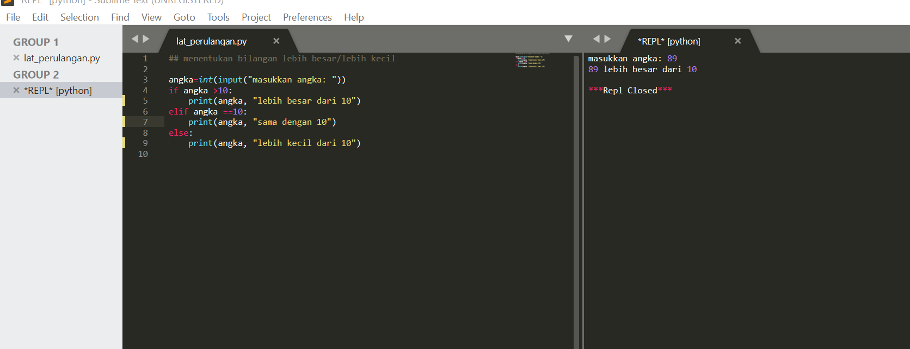
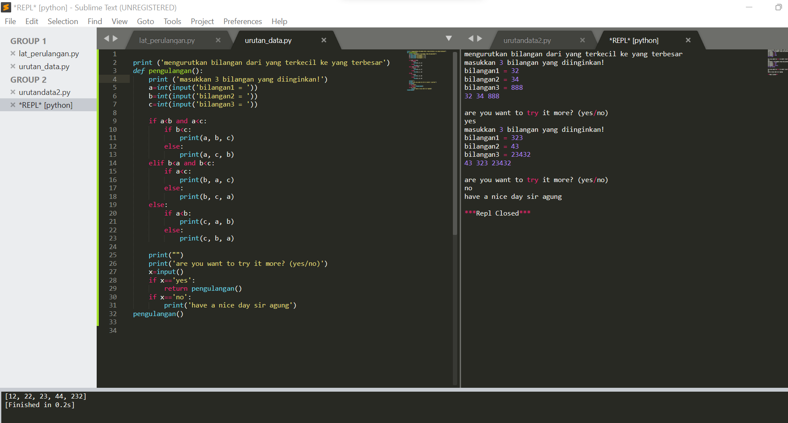
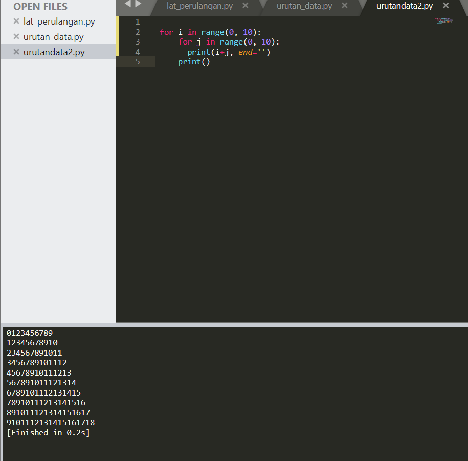
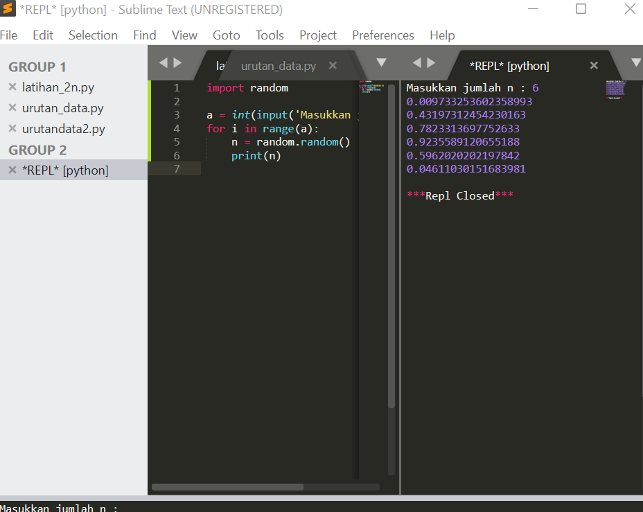

## **penjelasan tugas pertemuan 7**

#### Buat program sederhada dengan input 2 buah bilangan, kemudian tentukan bilangan terbesar dari kedua bilangan tersebut menggunakan statement if.

pertama masukkan int, lalu di ikuti dengan perintah if elif dan else, sertakan pula tanda < (lebih keci dari) untuk memberikan perintah. lebih jelasnya seperti pada foto

#### Buat program untuk mengurutkan data berdasarkan input sejumlah data (minimal 3 variable input atau lebih), kemudian tampilkan hasilnya secara berurutan mulai dari data terkecil.

'''

   if a<b and a<c:
        if b<c:
            print(a, b, c)
        else:
            print(a, c, b)
    elif b<a and b<c:
        if a<c:
            print(b, a, c)
        else:
            print(b, c, a)
    else:
        if a<b:
            print(c, a, b)
        else:
            print(c, b, a)

'''

 seperti contoh diatas, perintah akan if elif dan else akan di deklarasikan seperti yang terdapat pada contoh, untuk lebih lengkapnya seperti gambar di bawah ini

#### Buat program dengan perulangan bertingkat (nested) 

kali ini saya menggunakan for dan range sintaxnya seperti ini:

'''
 for i in range(0, 10):
	for j in range(0, 10):
	  print(i+j, end='')
	print()

'''
sebagai contoh pemamparan seperti pada gambar

#### Tampilkan n bilangan acak yang lebih kecil dari 0.5. nilai n diisi pada saat runtime

dalam kasus kali ini saya menggunakan perintah seperti di bawah ini

'''
 import random

a = int(input('Masukkan jumlah n : '))
for i in range(a):
    n = random.random()
    print(n)

'''
sebagai contoh saya sertakan gambar di bawah ini

####Mencari bilangan terbesar
1. masukan a,b,c sebagai perintah inputan, kemudian tambahkan if menandakan a lebih besar dari c.
2. lalu tekan titik dua makan akan seperti ini if a > c: lakukan juga hal yang sama pada y dan z.
3. kemudian masukan bilangan terbesar lalu tambahkan elif dan else sebagai penambah aksi sebagai penentu a lebih besar dari c dan b lebih besar dari c. maka kodingan setelah dirunningnya seperti ini.

![scs5]foto/scs5.png

#### mencari nilai n yang terbesar jumlah-nya
1. masukan max = 0. fungsinya adalah untuk mengetahui nilai terbesarnya.
2. kemudian tambahkan perintah while True:
3. setelah itu masuk\kan x=int(input("Masukkan bilangan"))
4. lalu if max <x:> pastikan sejajar dengan x
5. masukan perintah max = x
6. masukan perintah if x==0:
7. lalu tekan enter dan ketik break

![scs6]foto/scs6.png

#### Total laba bulan 1 sampai 8
1. masukan nilai a = 100000000
2. masukan perintah for x in range (1,9)
3. supaya ada 9 buah masukan if seperti gambar dibawah ini kemudia print total laba

![scs7]foto/scs7.png

## atas perhatiannya saya ucapkan terimakasih, apabila banyak penjelasan saya yang kurang dapat untuk di pahami saya minta maaf.

##end